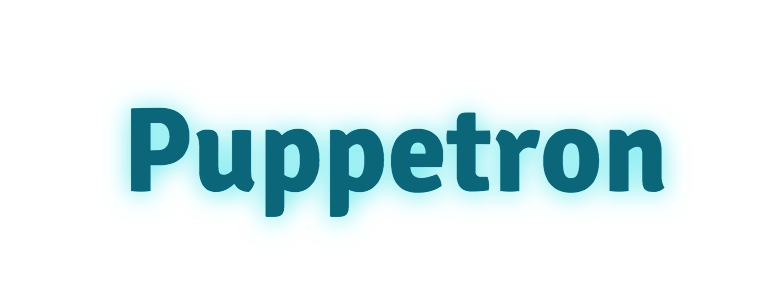

# 

> [Puppeteer](https://github.com/GoogleChrome/puppeteer) (Headless Chrome Node API)-based rendering solution.

API
---

**`URL`** - the URL with encoded `pathname`, `search` and `hash`.

### Screenshot

```
/screenshot/{URL}

...or

/{URL}
```

Parameters:

- `width` - width of screenshot (default: `1024`)
- `height` - height of screenshot (default: `768`)
- `thumbWidth` - width of thumbnail, respecting aspect ratio (no default, has to be smaller than `width`)
- `fullPage` - takes a screenshot of the full scrollable page (default: `false`). If the page is too long, it may time out.

### Render

```
/render/{URL}
```

Notes:

- `script` tags except `JSON-LD` will be removed
- `link[rel=import]` tags will be removed
- HTML comments will be removed
- `base` tag will be added for loading relative resources

Parameters: *None*

### PDF

```
/pdf/{URL}
```

Parameters:

- `format`: Paper format that [Puppeteer supports](https://github.com/GoogleChrome/puppeteer/blob/master/docs/api.md#pagepdfoptions). E.g.: `Letter`, `Legal`, `A4`, etc. (default: `Letter`)
- `pageRanges`: Paper ranges to print. E.g., `1-5`, `8`, `11-13` (default all pages)

Development
---

### Requirements

- Node.js
- Docker

For local Chromium install:

1. `npm install`
2. `npm start`
3. Load `localhost:3000`

For Docker-based install:

1. `docker build . -t puppet`
2. `docker run -p 8080:3000 puppet`
3. Load `localhost:8080`

[](https://deploy.now.sh/?repo=https://github.com/cheeaun/puppetron)

Credits
---

Block list from [Prerender](https://github.com/prerender/prerender/blob/master/lib/resources/blocked-resources.json).

This uses [`zenato/puppeteer`](https://hub.docker.com/r/zenato/puppeteer/) Docker image. Inspired by [`puppeteer-renderer`](https://github.com/zenato/puppeteer-renderer).
